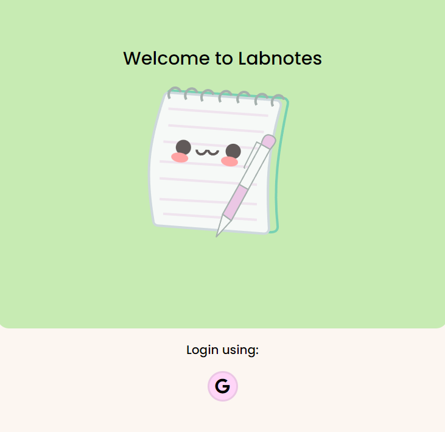
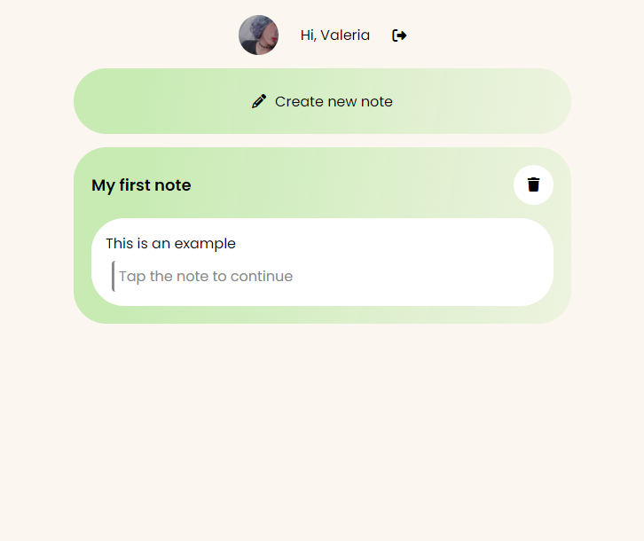
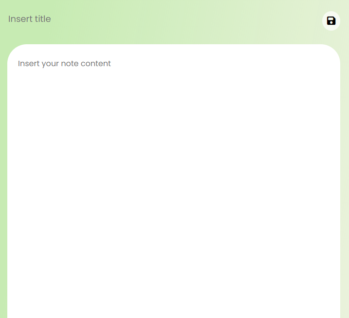

# Lab Notes

Progressive Web Application designed for note-taking, featuring full CRUD functionality.

Labnotes PWA allows users to Create, Read, Update, and Delete notes effortlessly, empowering them to capture ideas, tasks, and reminders with ease. Whether on a desktop or a mobile device, users can access their notes anytime, anywhere, without compromising on functionality or performance.

## Technology stack:
* Angular, TypeScript
* Angular Material UI

## Features:
* Authentication with Google.
* Sign off.
* Create a new note.
* See my notes.
* Edit my notes.
* Delete my notes.

## Routes:

